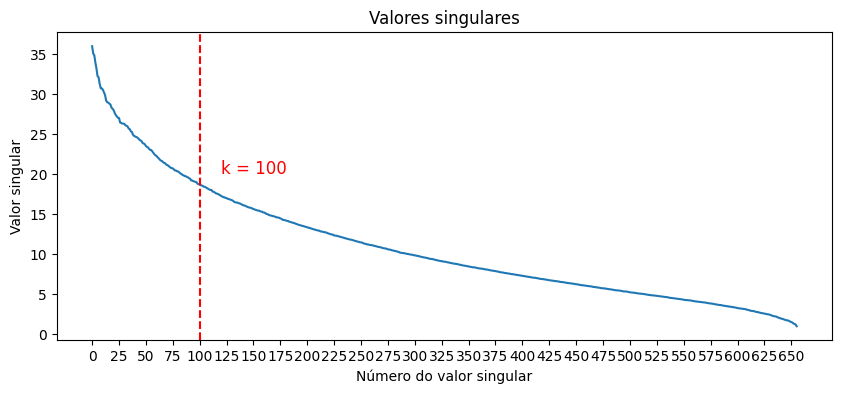
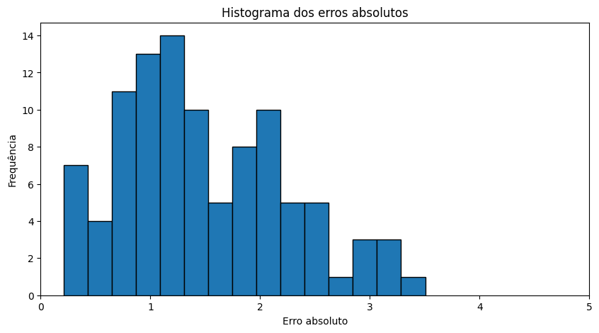
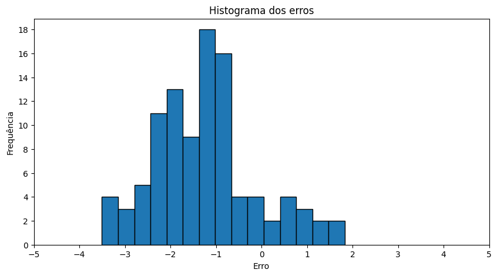

# Álgebra Linear - APS 5 - 2024.1 [Insper](https://www.insper.edu.br/pt/home)

## Autores do Projeto
- [Ian Cordibello Desponds](https://github.com/iancdesponds)
- [Gustavo Barroso Cruz](https://github.com/Gubscruz)

# [Projeto - O Desafio Netflix](https://github.com/iancdesponds/algebra-linear-desafio-netflix)

## Descrição do Projeto
Este projeto implementa um sistema de recomendação que estima a nota que um usuário poderia dar a um filme baseado em perfis típicos de usuários. O objetivo é prever avaliações em uma matriz de usuários por filmes, onde alguns valores foram alterados aleatoriamente para simular a incerteza real de avaliações não observadas.

## Funcionamento do Sistema
### Criação da Matriz de Avaliação
A matriz inicial é construída a partir de um arquivo CSV contendo avaliações de filmes por diversos usuários. Esta matriz, denominada `A`, é preenchida com as médias das avaliações onde não existem dados, tratando os casos de filmes não avaliados por alguns usuários.

### Introdução de Ruído
Para simular um cenário real onde a nota de um filme por um usuário é desconhecida, o sistema seleciona aleatoriamente avaliações na matriz `A` e substitui esses valores por números gerados aleatoriamente dentro do intervalo permitido de avaliações (0.5 a 5.0). Esta matriz modificada é chamada de `A_temp`.

### Recuperação de Valores via Decomposição em Valores Singulares (SVD)
A técnica de SVD é aplicada para decompor a matriz `A_temp` em três componentes: `U`, `S` e `V`. A matriz `S` é uma matriz diagonal que contém os valores singulares de `A_temp`, representando a "força" ou a importância de cada componente singular na reconstrução da matriz original.

**Redução de Dimensionalidade:**
Para filtrar o ruído introduzido, aplicamos uma redução de dimensionalidade ajustando os valores singulares. Os valores abaixo de um certo limiar k são zerados, o que corresponde à eliminação de componentes menos significativos que podem representar o ruído ou a variabilidade aleatória nos dados.

O valor de k foi escolhido utilizando o método de Elbow, que consiste em plotar os valores singulares (a partir do 15° elemento, para facilitar a visualização, dado que os primeiros elementos possuem a maior parte da informação e destoam dos demais valores) em ordem decrescente e escolher o ponto onde a curva começa a se estabilizar.

**Reconstrução da Matriz:**
Após ajustar os valores singulares, reconstruímos a matriz `A` estimada multiplicando `U`, `S` ajustada e `V`. Este processo é essencial para tentar recuperar os valores reais antes da introdução do ruído.

Todo esse processo foi realizado 100 vezes em um loop, para ter dados suficientes para análise dos erros e avaliação do desempenho do sistema.

### Cálculo de Erros
Os erros entre os valores estimados e os originais são calculados para avaliar a precisão das previsões. Estes erros são apresentados através de um histograma para visualizar a distribuição e a magnitude dos erros.

## Resultados e Discussão
### Análise dos Erros

O algoritmo apresentou um desempenho satisfatório na recuperação dos valores originais, com uma média de erro absoluto de 1.48 e um erro médio de -1.24. A distribuição dos erros é mostrada nos histogramas abaixo.

Percebe-se que o algoritmo tendeu a dar avaliações mais baixas do que as originais, o que pode ser explicado pela introdução de ruído nos dados. Ainda assim, a maioria dos erros está concentrada em torno de 1, o que indica que o sistema foi capaz de recuperar a maioria dos valores originais.

## Conclusão
Este projeto explora conceitos fundamentais de sistemas de recomendação e processamento de matrizes. As técnicas usadas aqui, como SVD e redução de dimensionalidade, são poderosas para entender e manipular grandes conjuntos de dados, oferecendo insights sobre como melhorar a precisão das recomendações em cenários reais.

## Como Executar
1. Clone o repositório do projeto.
2. Instale as bibliotecas necessárias executando o comando `pip install -r requirements.txt`.
3. Execute o arquivo `demo.py` para ver o sistema em ação. Este script executa o procedimento de predição e mostra os resultados em um histograma de erros.

## Arquivos no Repositório
- `main.ipynb`: Jupyter notebook com todo o código e explicações detalhadas.
- `demo.py`: Script Python para demonstração dos testes e análise dos resultados.
- `data/`: Diretório contendo os dados de avaliações e os resultados dos erros.